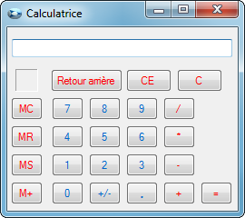

# Premiers Pas en C#

## Detail du Projet :
Il s’agit d'écrire un programme qui fasse la même chose que la Calculatrice livrée avec Windows, dans sa version "standard". 
Pour simplifier encore un peu le développement On ne développera pas le menu, ni l’aide, ni les fonctions suivantes : 
"MC", "MR", "MS"."M+" 
La calculatrice ressemblera donc à ceci :

## Contrainte :
	- Projet à effectuer en une journée
	- Projet Individuel
	- Un lien vers un répertoire git du projet
	- Le résultat final doit avoir exactement les mêmes composants d'interface  Calculatrice que l'image ci-dessus (Veuillez trouver, en pièce jointe). 
	  Tous les buttons doit fonctionner correctement.

## Difficulté :
	- L'apprentissage d'un nouveau langage
	- Les notions des éléments graphiques xaml
	- Logique de gestion du fonctionnement

## Pour aller plus loin :
	- Création des mèthodes : MC/MR/MS/M+
	- Avoir un Historique d'affichage
	- Créer un système de licence utilisateur avec une api

## Api test pour login en post:
https://apimycalc974.000webhostapp.com/
Creation d'un fichier dans le dossier doc pour simuler la connexion avec une api avec une requete post 